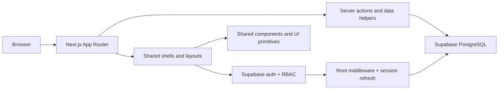

# Bonzer Logistics ERP Architecture

## Purpose

Bonzer is a modular logistics ERP built as a web-first Next.js application with Supabase as the primary data and auth platform. The architecture is designed around reusable shared infrastructure, isolated business modules, and forward-only database changes.

This document is the project architecture reference for the current codebase. It is based on the active workspace structure, the Claude reference notes, and the instructions in `.agents/architect.md` and `.agents/project-context.md`.

## Core Principles

- Modular by default.
- Reuse existing code before creating new code.
- Keep business logic inside the owning module.
- Keep shared logic in shared libraries.
- Avoid duplicate utilities and duplicate permission checks.
- Prefer server-side validation and server components where possible.
- Never edit historical migrations.
- Never invent a new folder if an existing one fits.

## High-Level Runtime

## Repository Layout

### Application layer

- `app/` holds all App Router routes, layouts, and page entry points.
- `app/layout.tsx` defines the global HTML shell, fonts, theme provider, auth provider, and toaster.
- `app/page.tsx` immediately redirects authenticated users to `/dashboard`.
- `app/(app)/layout.tsx` wraps the protected application surface in the shared app shell.
- `app/login`, `app/signup`, and `app/set-password` are public auth flows.

### Shared UI layer

- `components/` contains reusable UI, shells, and cross-module components.
- `components/ui/` contains the shadcn-style base primitives.
- `components/auth/` contains login-specific visual and form pieces.
- `components/app-shell.tsx`, `components/admin-layout.tsx`, and `components/team-layout.tsx` are workspace shells for different product areas.
- `components/customer-workspace.tsx`, `components/enquiry-form.tsx`, `components/enquiry-detail-panel.tsx`, `components/charts.tsx`, and `components/kpi-card.tsx` are module-oriented UI pieces.

### Shared logic layer

- `lib/` holds shared helpers, Supabase clients, server actions, and utility code.
- `lib/db/` contains the runtime Supabase clients and session middleware helpers.
- `lib/actions/` contains server-side operations grouped by domain.
- `lib/supabase.ts` contains shared client-side Supabase access plus current ERP entity types.
- `lib/nav.ts` defines shared navigation metadata for the app shell and module menus.
- `lib/utils.ts` contains generic helpers such as `cn()`.

### Database layer

- `supabase/migrations/` is the forward-only migration path.
- `supabase/legacy-migrations/` exists for historical reference only.
- Database changes must be added as new migrations, not by editing old ones.

### Reference and planning material

- `claude/` contains migration notes, setup guides, example files, and reference implementations.
- `research/` contains planning notes and design exploration.
- `documentation/` contains canonical project documentation.

### Separate backend package

- `backend/` is a standalone Node/Express package with its own `package.json`, `tsconfig.json`, and source tree.
- It currently exposes a minimal `/api/health` route and is isolated from the Next.js App Router runtime.
- The primary application surface remains the Next.js app unless this package is explicitly expanded into a separate service.

## Route and Layout Architecture

### Public routes

Public routes are handled without the protected app shell:

- `/login`
- `/signup`
- `/set-password`
- `/api/auth/*`

### Protected app routes

Protected product routes live under the main app workspace and are rendered through `AppShell`:

- `/dashboard`
- `/enquiries`
- `/customers`
- `/shipments`
- `/quotations`
- `/invoices`
- `/reports`
- `/analytics`
- `/settings`
- `/team`
- `/admin`

### Layout hierarchy

1. `app/layout.tsx` establishes the global document, fonts, theme, auth state, and toaster.
2. `app/(app)/layout.tsx` mounts `AppShell` for authenticated product pages.
3. `components/app-shell.tsx` coordinates `Sidebar`, `Topbar`, and `CommandPalette`.
4. `components/admin-layout.tsx` and `components/team-layout.tsx` provide narrower workspaces for admin and team-specific surfaces.
5. `components/auth-shell.tsx` provides the public auth experience with the login/signup visual split.

## Authentication and RBAC

Supabase is the single authentication system.

### Client and server clients

- `lib/db/client.ts` creates the browser Supabase client.
- `lib/db/server.ts` creates the server Supabase client for server components and actions.
- `lib/db/middleware.ts` refreshes the session cookies during middleware execution.

### Auth state

- `components/auth-provider.tsx` loads the current session and `get_my_auth_context` RPC data.
- The auth provider exposes `user`, `profile`, `roles`, `permissions`, and helpers like `hasRole()` and `can()`.
- Sign-out returns the user to `/login`.

### Route protection

- `middleware.ts` refreshes the Supabase session first.
- Public routes are left open.
- All other matched routes require an authenticated Supabase user.
- RBAC is driven by the `get_my_auth_context` RPC result, which is expected to return roles and permissions for the current user.

### RBAC model

The project uses role-and-permission context rather than scattered manual checks.

Typical roles represented in the architecture are:

- Admin
- Sales Manager
- Salesperson
- Operations
- Accounts

The exact role set lives in the database and is surfaced through `get_my_auth_context`.

## Data and Service Layer

### Shared query model

- Shared business entities and status types are defined in `lib/supabase.ts`.
- Current entity models include `Customer`, `Enquiry`, `Shipment`, `Invoice`, `ActivityLog`, and `TeamMember`.
- Status unions such as `EnquiryStatus`, `ShipmentStatus`, `InvoiceStatus`, and `ShipmentMode` are centralized there to avoid duplicated domain constants.

### Server actions

- Domain mutations and reads should live in `lib/actions/<domain>/`.
- The current customer domain already uses `create-customer.ts`, `list-customers.ts`, `update-customer.ts`, and `types.ts`.
- Business UI should call these actions instead of duplicating direct query logic in components.

### Reusable helper layer

- `lib/utils.ts` contains generic helpers only.
- Avoid turning it into a catch-all for business logic.
- If a helper is domain-specific, place it with the owning domain or in `lib/actions/<domain>/`.

## Module Structure

The current product is organized as independent business modules that share the same infrastructure.

### Current module surfaces

- `dashboard`
- `enquiries`
- `customers`
- `shipments`
- `quotations`
- `invoices`
- `reports`
- `analytics`
- `settings`
- `team`
- `admin`

### Module placement rules

- Put module-specific UI in the owning module surface or a clearly named module component.
- Put reusable UI in `components/` or `components/ui/`.
- Put shared data access in `lib/actions/` or `lib/db/`.
- Do not create a parallel helper folder when a shared layer already exists.

### Current customer module example

The customer area already shows the intended pattern:

- `components/customer-workspace.tsx` contains customer workspace behavior.
- `lib/actions/customers/*` contains customer data operations.
- `components/ui/*` provides the input, dialog, card, and avatar primitives used by the workspace.

## Shared Shells and Navigation

### Main app shell

`components/app-shell.tsx` owns the main authenticated layout:

- `Sidebar` for navigation.
- `Topbar` for top-level actions.
- `CommandPalette` for global commands.

### Secondary shells

- `components/admin-layout.tsx` wraps admin-specific workspaces with `AdminSidebar`.
- `components/team-layout.tsx` wraps team-specific workspaces with `TeamSidebar`.
- `components/auth-shell.tsx` provides the branded auth entry experience and split-screen visual treatment.

### Navigation

- `lib/nav.ts` is the shared navigation source of truth.
- Navigation should be extended there instead of duplicating menu definitions in multiple components.

## UI System

### Reusable primitives

- `components/ui/` is the base design system layer.
- Use these primitives before creating custom one-off controls.

### Brand and theme

- The app uses `ThemeProvider` and `ThemeToggle`.
- Fonts are configured globally in `app/layout.tsx` using `Manrope` and `IBM Plex Mono`.
- The visual system favors a modern logistics/operations look with dark shells, orange accents, and high-contrast workspace panels.

### Special-purpose UI

- `components/auth/AuthBackground.tsx` and `components/auth/PasswordInput.tsx` are auth-specific visual components.
- `components/module-placeholder.tsx` is used for unbuilt or transitional modules.
- `components/loading-screen.tsx` and `hooks/use-toast.ts` support shared app feedback patterns.

## Database and Migration Strategy

### Migration rules

- Create new migrations for schema changes.
- Do not edit historical migrations.
- Keep changes forward-only and backward-compatible when possible.

### Supabase guidance

- Auth, profiles, and permissions are handled in Supabase.
- RLS is the primary data-access boundary.
- Storage, if used for photos or documents, should follow bucket-level policies and owner-based access rules.

### Expected database shape

The setup notes and current types indicate a logistics ERP data model centered on:

- users
- customers
- enquiries
- shipments
- invoices
- attendance
- daily stats
- activity logs

## Build and Tooling

- Next.js App Router is the primary frontend runtime.
- TypeScript is strict by policy and should remain the default for new code.
- Tailwind CSS and shadcn/ui form the main UI stack.
- The workspace uses the `@/*` path alias.
- `claude/` is excluded from the TypeScript build and should remain reference-only.

## File Placement Rules

When adding new code, follow this order of decision making:

1. Reuse an existing component, action, helper, or layout if it fits.
2. Put module logic inside the owning module.
3. Put shared logic in `components/`, `lib/`, or `lib/actions/`.
4. Put database changes in a new migration.
5. Only create a new folder when the existing structure cannot reasonably hold the code.

## What Not To Do

- Do not duplicate auth logic in routes and components.
- Do not duplicate database helpers across modules.
- Do not put business logic inside generic UI primitives.
- Do not create a second shared utilities layer when `lib/` already exists.
- Do not bypass RBAC by querying privileged data from the wrong layer.

## Notes From The Current Workspace

- There is no root README file in the workspace.
- The `claude/` folder acts as reference material for migration and setup, not as runtime source.
- The separate `backend/` package exists, but the Next.js app remains the primary architecture surface.

## Architecture Summary

Bonzer is organized as a single Next.js product shell with Supabase-backed auth, RBAC, and data access, plus shared UI and shared actions that keep modules independent. The implementation strategy is to centralize reusable infrastructure, keep module code local to each business area, and use migrations and server-side helpers to prevent duplication and architectural drift.